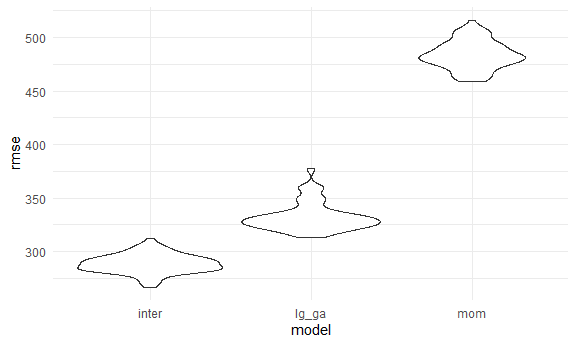
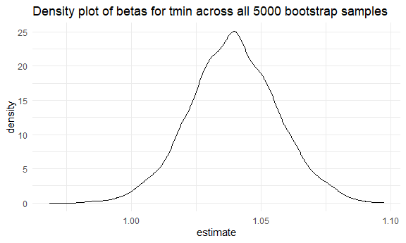
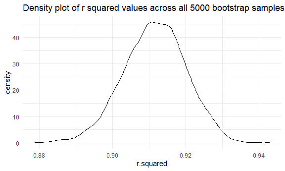
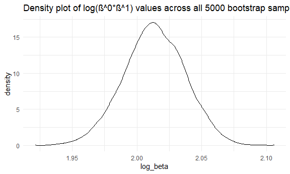

Homework 5
================
Sushupta Vijapur (smv2138)

``` r
library(tidyverse)
```

    ## -- Attaching packages --------------------------------------------------------- tidyverse 1.3.0 --

    ## v ggplot2 3.3.2     v purrr   0.3.4
    ## v tibble  3.0.3     v dplyr   1.0.2
    ## v tidyr   1.1.2     v stringr 1.4.0
    ## v readr   1.3.1     v forcats 0.5.0

    ## -- Conflicts ------------------------------------------------------------ tidyverse_conflicts() --
    ## x dplyr::filter() masks stats::filter()
    ## x dplyr::lag()    masks stats::lag()

``` r
library(modelr)
library(p8105.datasets)

knitr::opts_chunk$set(
  fig.width = 6,
  fig.asp = 0.6,
  out.width = "90%"
)

theme_set(theme_minimal() + theme(legend.position = "bottom"))

## all plots i make will have the viridis color palette
options(
  ggplot2.continuous.colour = "viridis",
  ggplot2.continuous.fill = "viridis"
)

scale_colour_discrete = scale_colour_viridis_d
scale_fill_discrete = scale_fill_viridis_d
```

## Problem 1

``` r
homicide_df <- 
  read_csv("hom_data/homicide-data.csv", na = c("", "NA", "Unknown")) %>% 
  mutate(
    city_state = str_c(city, state, sep = ", "),
    victim_age = as.numeric(victim_age), 
    resolved = case_when(
      disposition == "Closed without arrest" ~ 0, 
      disposition == "Open/No arrest" ~ 0, 
      disposition == "Closed by arrest" ~ 1,
    )
  ) %>% 
  filter(
    city_state != "Tulsa, AL", 
    victim_race %in% c("White", "Black")) %>% 
  select(city_state, resolved, victim_age, victim_race, victim_sex)
```

    ## Parsed with column specification:
    ## cols(
    ##   uid = col_character(),
    ##   reported_date = col_double(),
    ##   victim_last = col_character(),
    ##   victim_first = col_character(),
    ##   victim_race = col_character(),
    ##   victim_age = col_double(),
    ##   victim_sex = col_character(),
    ##   city = col_character(),
    ##   state = col_character(),
    ##   lat = col_double(),
    ##   lon = col_double(),
    ##   disposition = col_character()
    ## )

Start with one city

``` r
baltimore_df <-
  homicide_df %>% 
  filter(city_state == "Baltimore, MD")

glm(resolved ~ victim_age + victim_race + victim_sex, 
    data = baltimore_df, 
    family = binomial()) %>% 
  broom::tidy() %>% 
  mutate(
    OR = exp(estimate), 
    CI_lower = exp(estimate - 1.96 * std.error), 
    CI_upper = exp(estimate + 1.96 * std.error)
  ) %>% 
  select(term, OR, starts_with("CI")) %>% 
  knitr::kable(digits = 3)
```

| term              |    OR | CI\_lower | CI\_upper |
| :---------------- | ----: | --------: | --------: |
| (Intercept)       | 1.363 |     0.975 |     1.907 |
| victim\_age       | 0.993 |     0.987 |     1.000 |
| victim\_raceWhite | 2.320 |     1.648 |     3.268 |
| victim\_sexMale   | 0.426 |     0.325 |     0.558 |

Let’s try this across cities

``` r
model_results_df <-
homicide_df %>% 
  nest(data = -city_state) %>% 
  mutate(
    models = 
      map(.x = data, ~glm(resolved ~ victim_age + victim_race + victim_sex, data = .x, family = binomial())), 
    results = map(models, broom::tidy)
  ) %>% 
  select(city_state, results) %>% 
  unnest(results) %>% 
  mutate(
    OR = exp(estimate), 
    CI_lower = exp(estimate - 1.96 * std.error), 
    CI_upper = exp(estimate + 1.96 * std.error)
  ) %>% 
  select(city_state, term, OR, starts_with("CI"))
```

``` r
model_results_df %>% 
  filter(term == "victim_sexMale") %>% 
  mutate(city_state = fct_reorder(city_state, OR)) %>% 
  ggplot(aes(x = city_state, y = OR)) +
  geom_point() +
  geom_errorbar(aes(ymin = CI_lower, ymax = CI_upper)) +
  theme(axis.text.x = element_text(angle = 90, hjust = 1))
```


## Problem 2

compare 3 models using CV build a model (open ended) start with checking
for cross validation Porbably want to do some work with factor variables
Find some residuals

#### Part 1 - Loading data and cleaning data

Load and clean the data for regression analysis (i.e. convert numeric to
factor where appropriate, check for missing data, etc.).

``` r
baby_df = 
  read_csv("./hom_data/birthweight.csv") %>% 
   mutate(
    babysex = as.factor(babysex), 
    frace = as.factor(frace), 
    malform = as.factor(malform), 
    mrace = as.factor(mrace)
  ) 
```

    ## Parsed with column specification:
    ## cols(
    ##   .default = col_double()
    ## )

    ## See spec(...) for full column specifications.

Checking for NAs

``` r
count_na = 
  baby_df %>% 
    map_df(~sum(is.na(.)))
```

Based on the function above, it appears that there are no NAs in this
the `baby_df` for any of the variables

#### Part 2 - Building a model

Variables I’m interested in looking at

  - `pnumlbw` - previous number of low birth weight babies
  - `ppbmi`- mother’s pre-pregnancy BMI
  - `ppwt` - mother’s pre-pregnancy weight (pounds)
  - `wtgain` - mother’s weight gain during pregnancy (pounds)

Will check the linear association between the above variables and
birthweight to see if we can fit a linear regression.

``` r
pnumlbw_linear = 
baby_df %>% 
  ggplot(aes(x = pnumlbw, y = bwt)) +
  geom_point()

ppbmi_linear = 
baby_df %>% 
  ggplot(aes(x = ppbmi, y = bwt)) +
  geom_point()

ppwt_linear = 
baby_df %>% 
  ggplot(aes(x = ppwt, y = bwt)) +
  geom_point()

wtgain_linear = 
baby_df %>% 
  ggplot(aes(x = wtgain, y = bwt)) +
  geom_point()
```

Based on the above graphs, we can see that no mother in this dataset had
a previous number of low birth weight babies. Therefore, we will drop
this variable from furher analysis. They other 3 variables appear to
have a linear relationship with the outcome of birthweight, therefore,
we will move forward with analyzing these.

Fit the model and show a plot of model residuals against fitted values

``` r
## Pre-pregnancy BMI model
lm(bwt ~ ppbmi, data = baby_df) %>% 
        broom::tidy() %>% 
  knitr::kable()
```

| term        |   estimate | std.error | statistic | p.value |
| :---------- | ---------: | --------: | --------: | ------: |
| (Intercept) | 2788.25190 | 53.033122 | 52.575669 |       0 |
| ppbmi       |   15.12037 |  2.432291 |  6.216514 |       0 |

``` r
## Pre-pregnancy weight model
lm(bwt ~ ppwt, data = baby_df) %>% 
        broom::tidy() %>% 
  knitr::kable()
```

| term        |    estimate |  std.error | statistic | p.value |
| :---------- | ----------: | ---------: | --------: | ------: |
| (Intercept) | 2540.669117 | 47.4345568 |  53.56157 |       0 |
| ppwt        |    4.645982 |  0.3790969 |  12.25539 |       0 |

``` r
## Weight gained during pregnancy model
lm(bwt ~ wtgain, data = baby_df) %>% 
        broom::tidy() %>% 
  knitr::kable()
```

| term        |   estimate |  std.error | statistic | p.value |
| :---------- | ---------: | ---------: | --------: | ------: |
| (Intercept) | 2858.91376 | 16.9621258 | 168.54690 |       0 |
| wtgain      |   11.57031 |  0.6882738 |  16.81063 |       0 |

After fitting all three of these models, we can see that they all have
significant p-values. We can assume from this that they are all related
to birthweight in some way. However, since mother’s pre-pregnancy
birthweight and pre-pregnancy BMI are most likely highly correlated with
eachother, and largely provide the same information, we will choose to
move forward with just mother’s pre-pregnancy weight. We will fit a
final model with mother’s pre-pregnancy weight and weight gain during
the pregnancy as predictors to see if mother’s weight have an influence
on

``` r
mom_wt = lm(bwt ~ ppwt + wtgain, data = baby_df)

baby_df %>% 
  modelr::add_residuals(mom_wt) %>% 
  modelr::add_predictions(mom_wt) %>% 
  ggplot(aes(x = resid ,y = pred)) +
  geom_point()
```


``` r
baby_df %>% 
  modelr::add_residuals(mom_wt) %>% 
  ggplot(aes(x = resid)) +
  geom_density()
```


Based on the plot of residuals versus predicted values, we can see that
the linearity assumption is still valid and there are no concerning
outliers or unequal variances. Based on the density plot of the
residuals, we can see they are relatively normally distributed and have
a center of near 0 residuals. Therefore, we can assume that the model is
fit well and our assumptions are valid.

#### Part 3 - Running models asked to examine

Model using length at birth and gestational age as predictors (main
effects only)

``` r
lg_ga_model = lm(bwt ~ blength + gaweeks, data = baby_df)

baby_df %>% 
  modelr::add_residuals(lg_ga_model) %>% 
  modelr::add_predictions(lg_ga_model) %>% 
  ggplot(aes(x = resid ,y = pred)) +
  geom_point()
```


``` r
baby_df %>% 
  modelr::add_residuals(lg_ga_model) %>% 
  ggplot(aes(x = resid)) +
  geom_density()
```


The plot of the residuals versus the predicted values show that there is
one potential outlier, with a high residual and low predicted value.
Otherwise, the scatter plot seems to show assumptions to be met. The
density plot shows that the residuals here are also normally distributed
and indicate that the assumptions have been met.

Model using head circumference, length, sex, and all interactions
(including the three-way interaction) between these

``` r
interaction_3 = lm(bwt ~ bhead + blength + babysex, data = baby_df)

baby_df %>% 
  modelr::add_residuals(interaction_3) %>% 
  modelr::add_predictions(interaction_3) %>% 
  ggplot(aes(x = resid ,y = pred)) +
  geom_point()
```


``` r
baby_df %>% 
  modelr::add_residuals(interaction_3) %>% 
  ggplot(aes(x = resid)) +
  geom_density()
```


The scatter plot of the residuals and predicted values show that there
may be some outliers in the data, but overall, the residuals and
predicted values are scatter near each other indicating assumptions are
met. The density plot shows that the residuals here are also normally
distributed and indicate that the assumptions have been met.

#### Part 4 - Compare models with Cross Validation

Use cross validation to compare the 3 models above

``` r
cv_df = 
  crossv_mc(baby_df, 100) %>% 
  mutate(
    train = map(train, as_tibble),
    test = map(test, as_tibble)
  )
```

Fit the 3 models to the training and testing datasets

``` r
cv_df = 
  cv_df %>% 
  mutate(
    mom_wt_mod  = map(.x = train, ~lm(bwt ~ ppbmi + ppwt + wtgain, data = .x)),
    lg_ga_mod = map(.x = train, ~lm(bwt ~ blength + gaweeks, data = .x)),
    inter_mod = map(.x = train, ~lm(bwt ~ bhead + blength + babysex, data = .x))
  ) %>% 
  mutate(
    rmse_mom = map2_dbl(.x = mom_wt_mod, .y = test, ~rmse(model = .x, data = .y)),
    rmse_lg_ga = map2_dbl(.x = lg_ga_mod, .y = test, ~rmse(model = .x, data = .y)),
    rmse_inter = map2_dbl(.x = inter_mod, .y = test, ~rmse(model = .x, data = .y))
  )
```

Plot distribution of root mean squared error for all 3 models to
visually compare them. Also calculate the average root mean sqaured
error for each model

``` r
cv_df %>% 
  select(starts_with("rmse")) %>% 
  pivot_longer(
    everything(),
    names_to = "model",
    values_to = "rmse",
    names_prefix = "rmse_"
  ) %>% 
  ggplot(aes(x = model, y = rmse)) +
  geom_violin()
```



``` r
cv_df %>% 
  select(starts_with("rmse")) %>% 
  pivot_longer(
    everything(),
    names_to = "model",
    values_to = "rmse",
    names_prefix = "rmse_"
  ) %>% 
  group_by(model) %>% 
  summarize(avg_rmse = mean(rmse)) %>% 
  knitr::kable()
```

    ## `summarise()` ungrouping output (override with `.groups` argument)

| model  | avg\_rmse |
| :----- | --------: |
| inter  |  287.3279 |
| lg\_ga |  330.1187 |
| mom    |  483.4706 |

Based on these violin plots and the calculated average root mean squared
error, it is clear that the model fitting the interaction between head
circumference, length and sex is the best model, with the lowest root
mean squared error. The model looking at baby’s length was the second
best. The model looking at mom’s pre-pregnancy weight and weight gained
had the highest root mean squared error.

## Problem 3

use bootstrap to get distribution of parameters you’re interested in fit
linear model of max emp against min temp r sq value and another random
param () \#\#\#\# Part 1 - Load 2017 Central Park Weather Data

``` r
weather_df = 
  rnoaa::meteo_pull_monitors(
    c("USW00094728"),
    var = c("PRCP", "TMIN", "TMAX"), 
    date_min = "2017-01-01",
    date_max = "2017-12-31") %>%
  mutate(
    name = recode(id, USW00094728 = "CentralPark_NY"),
    tmin = tmin / 10,
    tmax = tmax / 10) %>%
  select(name, id, everything())
```

    ## Registered S3 method overwritten by 'hoardr':
    ##   method           from
    ##   print.cache_info httr

    ## using cached file: C:\Users\sushu\AppData\Local\Cache/R/noaa_ghcnd/USW00094728.dly

    ## date created (size, mb): 2020-10-05 10:36:30 (7.537)

    ## file min/max dates: 1869-01-01 / 2020-10-31

#### Part 2 - Fit linear regression and generate 5000 bootstrap results

We’ll focus on a simple linear regression with tmax as the response and
tmin as the predictor Select r-squared value

``` r
bootstrap_results = 
  weather_df %>% 
  modelr::bootstrap(n = 5000, id = "strap_number") %>% 
  mutate(
    models = map(.x = strap, ~ lm(tmax ~ tmin, data = .x)),
    r_squared = map(models, broom::glance),
    results = map(models, broom::tidy)
  ) %>% 
  unnest(results) %>% 
  select(strap_number, term, estimate, r_squared) %>% 
  unnest(r_squared) %>% 
  select(strap_number, term, estimate, r.squared)
```

Calculate log(β<sup>0∗β</sup>1) and merging it into the bootstrap
results df

``` r
log_beta = 
  bootstrap_results %>% 
  select(strap_number:estimate) %>% 
  pivot_wider(
    names_from = term,
    values_from = estimate
  ) %>% 
  janitor::clean_names() %>% 
  mutate(
    log_beta = log(intercept*tmin)
  ) %>% 
  select(strap_number, log_beta)

final_df = left_join(bootstrap_results, log_beta, by = "strap_number")
```

#### Part 3 - Plot the distribution of your estimates

``` r
## Density plot of betas for tmin across all 5000 bootstrap samples
final_df %>% 
  filter(term == "tmin") %>% 
  ggplot(aes(x = estimate)) +
  geom_density() +
  labs(
    title = "Density plot of betas for tmin across all 5000 bootstrap samples"
  )
```



``` r
## Density plot of r squared values across all 5000 bootstrap samples
final_df %>% 
  filter(term == "tmin") %>% 
  ggplot(aes(x = r.squared)) +
  geom_density() +
  labs(
    title = "Density plot of r squared values across all 5000 bootstrap samples"
  )
```



``` r
## Density plot of log(β^0∗β^1) values across all 5000 bootstrap samples
final_df %>% 
  filter(term == "tmin") %>% 
  ggplot(aes(x = log_beta)) +
  geom_density() +
  labs(
    title = "Density plot of log(β^0∗β^1) values across all 5000 bootstrap samples"
  )
```


The three plots above show the distribution of b1 (tmin), r-squared and
log(β<sup>0∗β</sup>1) values across all 5000 bootstrap resamples. All
three graphs appear to have a normal distribution of values across all
samples.

#### Part 4 - Identify the 2.5% and 97.5% quantiles to provide a 95% confidence interval for r^2 and log(β<sup>0∗β</sup>1)

``` r
final_df %>% 
  group_by(term) %>% 
  filter(term == "tmin") %>%  
  summarize(
    rsq_ci_lower = quantile(r.squared, 0.025),
    rsq_ci_upper = quantile(r.squared, 0.975),
    logb_ci_lower = quantile(log_beta, 0.025),
    logb_ci_upper = quantile(log_beta, 0.975)
  ) %>% 
  knitr::kable()
```

    ## `summarise()` ungrouping output (override with `.groups` argument)

| term | rsq\_ci\_lower | rsq\_ci\_upper | logb\_ci\_lower | logb\_ci\_upper |
| :--- | -------------: | -------------: | --------------: | --------------: |
| tmin |      0.8946338 |      0.9275421 |        1.964767 |        2.059658 |

The 95% CI based on 5000 bootstrap resampling for the r squared values
is 0.8935 to 0.9270. The 95% CI based on 5000 bootstrap resampling for
the log(β<sup>0∗β</sup>1) value is 1.9653 to 2.0597.
